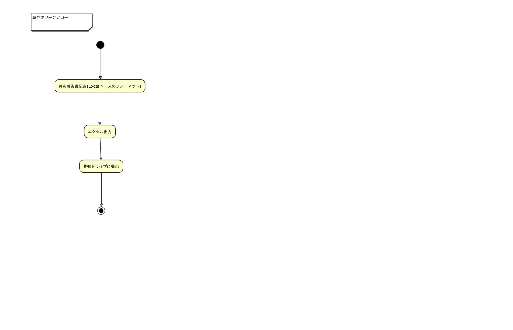
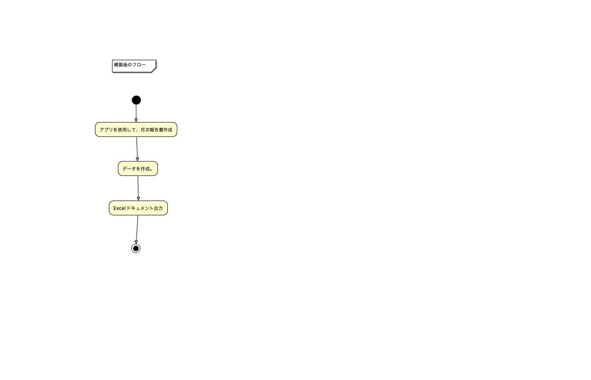

# 要件定義書
## 1,目的
本ドキュメントは、月次報告書作成アプリケーションの開発に関する要件を定義する。

	1,月次報告書を作成する、アプリケーションの開発。
	2,管理者と一般ユーザーで、機能を分ける。
	
## 2,概要
<h2>システム方式・構成</h2>
システム構成は次の通り。  

- アプリケーションサーバー

    APIサーバーからの応答を、画面に表示するサーバー。
- APIサーバー

    システムの機能を実装するサーバー。
- データーベースサーバー

    システム実現のために必要なデータを格納するサーバー

<h2>用語定義</h2>

- 月次報告書

    毎月会社に提出する、作業報告書。
    
<h2><strong>業務要件</strong></h2>

---

- 現状のフロー

	1,業務終了後に、Excelベースの月次報告書を作成する。
	2,作成後に、マクロを使用して業務時間を算出する。
	3,期日までに、月次報告書を提出する。

- 構築後のフロー

	1,業務終了後に、開発したアプリケーションを使用して月次報告書を作成する。
	2,作成後に、APIを使用して業務時間の算出をする。
	3,期日まで月次報告書を提出する。

<h2>利用者一覧</h2>

	管理者ユーザー(人事)
	一般ユーザー(一般社員)

<h2>規模</h2>
	
	4人月(エンジニア1×4ヶ月)の予定。

<h2><strong>機能要件</strong></h2>

---

<h2>画面</h2>

- ログイン画面

	管理者ユーザーと一般ユーザーの判断をする。

- 月次報告書記入画面

	月次報告書を記述する画面。

- 月次報告書編集画面

	記述した月次報告書を、削除・編集を行う画面。

- 常駐先情報変更画面

	常駐先が変わった場合、常駐先の情報を変更する場合。

- 社員追加画面(管理者)

	社員が増えた場合、アカウントを追加する画面。

- 社員情報変更画面(管理者)

	登録したアカウント情報を変更する画面。

<h2>権限</h2>

- 社員追加画面/社員情報編集画面は、管理者権限を持っているユーザーのみ表示する。

<h2>帳票</h2>

- 月次報告書_年月_社員名.xlsx

<h2>情報・データ</h2>
本システムでは、以下のデータが作成される。

- 常駐先データ

	常駐先名、就業時間などを格納する。

- 勤務時間データ

	常駐先データを元に、勤務時間を算出して情報を格納するデータ。

<h2>データーフロー</h2>
本システムのデータ処理は、次のようになる。

1,本システムに、常駐先の情報を入力する。 
2,本システムの、月次報告書記述・編集画面から勤務時間データをデータベースに格納する。 
3,作成した勤務時間データから、月次報告書を作成する。 